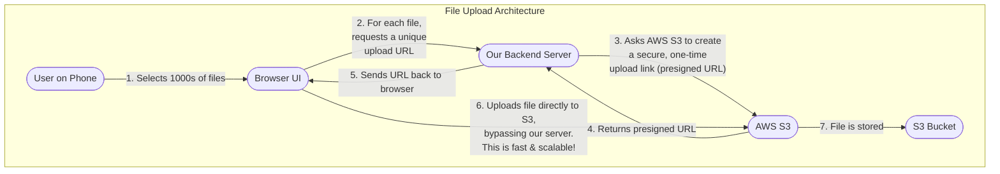

# Product Requirements Document: Scalable File Uploader

## 1. Objective

To build a simple, scalable, and robust web application that allows non-technical users to upload hundreds or thousands of large files (primarily photos and videos) to an AWS S3 bucket. The application will serve as a wrapper around S3, providing a user-friendly interface for bulk file transfers.

## ✅ PROJECT COMPLETED

This application has been successfully implemented! See the [README.md](README.md) for setup and usage instructions.

**What's been built:**
- React TypeScript frontend with modern UI
- Node.js/Express backend with AWS S3 integration
- Direct file uploads to S3 using presigned URLs
- Real-time upload progress tracking
- File listing and download functionality
- Responsive design with drag-and-drop support

## 2. Target Audience

The primary users are non-technical individuals who need to upload a large volume of media files from their mobile devices or desktops without dealing with complex tools.

## 3. Key Features & User Stories

### 3.1. Core Functionality

- **As a user, I want to select multiple files (hundreds or thousands) from my device's file browser at once.**
- **As a user, I want to upload all selected files with a single click.** The average file size is expected to be around 100MB, so the system must handle large files efficiently.
- **As a user, I want to see the progress of my uploads in real-time.** This includes individual file progress and overall batch progress.
- **As a user, I want to see a list of all the files I have successfully uploaded.**
- **As a user, I want to be able to download any of my uploaded files.**

### 3.2. Technical Requirements

- **Direct S3 Upload:** Files should be uploaded directly from the client to S3 to ensure scalability and performance, minimizing load on the backend server.
- **Simple Uploads:** Direct file upload to S3 using presigned URLs for simplicity and reliability.
- **Presigned URLs:** Secure, temporary URLs will be used for both uploading and downloading to ensure files are accessed safely without exposing AWS credentials on the client-side.

## 4. Proposed Architecture

The application will consist of a simple frontend, a lightweight backend, and AWS S3 for storage. The core of the architecture relies on the backend generating presigned URLs that authorize the client to directly upload files to S3.

### 4.1. Architecture Diagram

### 4.2. Technology Stack

- **Frontend:** React 19 with TypeScript and Vite for modern development experience
- **Backend:** Node.js with Express.js - minimal API with only 3 endpoints
- **Storage:** AWS S3 for scalable file storage
- **Architecture:** Clean, simple architecture with custom hooks and shared utilities

## 5. Development Plan

The project will be built in phases to deliver functionality incrementally.

### Phase 1: Backend Setup & Core Upload Logic
1.  **Initialize Backend:** Set up a Node.js/Express project.
2.  **Configure AWS:** Configure the AWS SDK with credentials to communicate with S3.
3.  **Create S3 Bucket:** Provision an S3 bucket for file storage.
4.  **Presigned URL Endpoint:** Implement a backend endpoint (`/generate-upload-url`) that generates presigned URLs for single-part uploads.

### Phase 2: Frontend for Basic Upload
1.  **Initialize Frontend:** Set up a basic React application.
2.  **File Input UI:** Create a simple UI that allows users to select multiple files.
3.  **Client-Side Upload Logic:** Write the JavaScript code to:
    -   Request a presigned URL from the backend for each file.
    -   Upload the file directly to S3 using the received URL.
4.  **Progress Indicators:** Implement UI elements to show upload progress for each file.

### Phase 3: Large File Support (Multipart Uploads)
1.  **Backend Multipart Init:** Create a backend endpoint to initiate a multipart upload and return an `UploadId`.
2.  **Backend Sign Parts:** Create a backend endpoint to generate presigned URLs for each part of the multipart upload.
3.  **Backend Complete/Abort:** Create endpoints to signal the completion or cancellation of a multipart upload.
4.  **Frontend Multipart Logic:** Implement client-side logic to:
    -   Chunk files into smaller parts.
    -   Manage the entire multipart upload lifecycle (initiate, upload parts, complete/abort).

### Phase 4: File Listing and Downloading
1.  **List Files Endpoint:** Create a backend endpoint to list all files in the S3 bucket.
2.  **Download URL Endpoint:** Implement a backend endpoint to generate presigned URLs for downloading files.
3.  **File List UI:** Create a frontend component to display the list of uploaded files and provide download buttons for each.

## 6. What's Out of Scope (for V1)

- **User Authentication:** The initial version will be open and will not have user accounts or authentication. All files will be uploaded to the same location.
- **File Deletion/Management:** Users will only be able to upload, list, and download files. There will be no functionality to delete, rename, or organize files.
- **Multiple Buckets/Keys:** All files will be stored in a single S3 bucket under a common key prefix. 